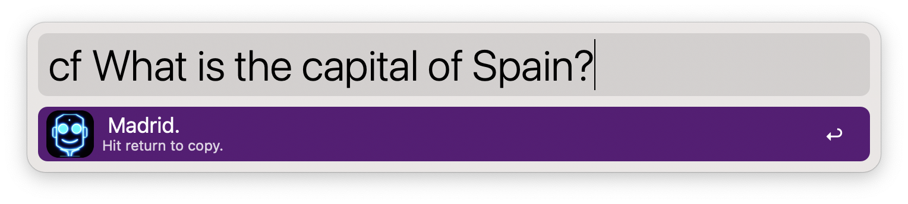

# ChatFred
**[Alfred](https://www.alfredapp.com/) workflow using [OpenAI's](https://openai.com/) GPT model for chatting, text completion and much more 🤖**

## Setup
The setup is simple. Just install the workflow and add your OpenAI API key. You can get your key [here](https://beta.openai.com/signup). Simply sign up and create an API key. Then add it to the workflow.

### Tweaking the workflow (optional)
You can tweak the workflow to your liking. The following parameters are available:
- `model`: Following models are available: `ada`, `babbage`, `curie`, `text-davinci-003` (ascending quality). Default: `text-davinci-003`.
- `temperature`: The temperature determines how greedy the generative model is. If the temperature is high, the model can output words other than the highest probability with a fairly high probability. The generated text will be more diverse, but there is a higher probability of grammar errors and the generation of nonsense. Default: `0`.
- `max_tokens`: The maximum number of tokens to generate in the completion. Default: `100`.
- `top_p`: Top-p sampling selects from the smallest possible set of words whose cumulative probability exceeds probability p. In this way, the number of words in the set can be dynamically increased and decreased according to the nearest word probability distribution. Default: `1`.
- `frequency_penalty`: A value between -2.0 and 2.0. The frequency penalty parameter controls the model’s tendency to repeat predictions. Default: `0`.
- `presence_penalty`: A Value between -2.0 and 2.0. The presence penalty parameter encourages the model to make novel predictions. Default: `0`.

 You can find more information about these parameters [here](https://platform.openai.com/docs/api-reference/completions/create).

## Usage
Just ask the model whatever you want. The model will answer to you. If you want to copy its answer, just press <kbd>RETURN</kbd> and paste it wherever you want.

GTP-3 is a very powerful model. It can answer questions, write stories, and even write code. You can find more examples [here](https://platform.openai.com/examples).

## GPT-3 and ChatGPT
OpenAI does not provide a ChatGPT API yet. Accordingly, this workflow also runs with the GPT-3 model. As soon as OpenAI or Microsoft Azure offers a ChatGPT API, it will be integrated into this workflow.
