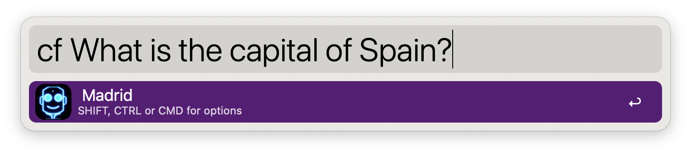
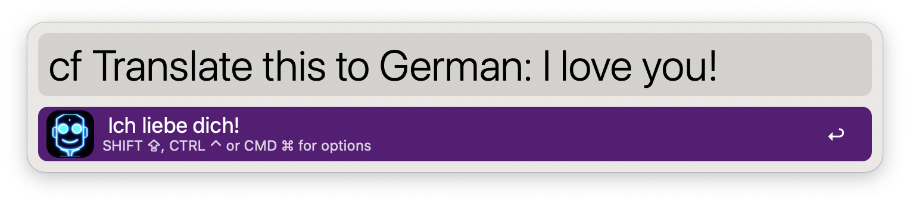
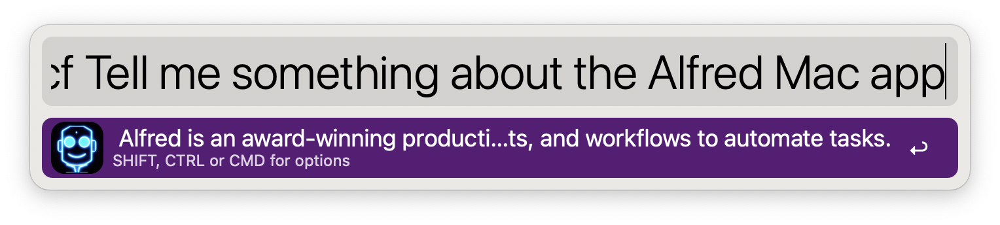

# ChatFred
**[Alfred](https://www.alfredapp.com/) workflow using [OpenAI's](https://openai.com/) GPT model for chatting, text completion and much more 🤖**

## Setup 🛠️
The setup is simple. Just install the workflow and add your OpenAI API key. You can get your key [here](https://beta.openai.com/signup) - You will receive $18 in free credit, no payment data is required and you can start talking to ChatFred right away.

### Tweaking the workflow (optional) 🦾
You can tweak the workflow to your liking. The following parameters are available:
- **OpenAI model**: Following models are available: `Ada`, `Babbage`, `Curie`, `Davinci` (ascending quality). Default: `Davinci`.
- **Temperature**: The temperature determines how greedy the generative model is. If the temperature is high, the model can output words other than the highest probability with a fairly high probability. The generated text will be more diverse, but there is a higher probability of grammar errors and the generation of nonsense. Default: `0`.
- **Maximum tokens**: The maximum number of tokens to generate in the completion. Default: `100`.
- **Top-p**: Top-p sampling selects from the smallest possible set of words whose cumulative probability exceeds probability p. In this way, the number of words in the set can be dynamically increased and decreased according to the nearest word probability distribution. Default: `1`.
- **Frequency penalty**: A value between -2.0 and 2.0. The frequency penalty parameter controls the model’s tendency to repeat predictions. Default: `0`.
- **Presence penalty**: A Value between -2.0 and 2.0. The presence penalty parameter encourages the model to make novel predictions. Default: `0`.
- **Always save replies**: If enabled, all replies will be saved to a file (`{Save to file directory}/ChatFred.txt`). Default: 'unchecked'.
- **Save to file directory**: Custom directory where the 'ChatFred.txt' should be stored. Default to the user's home directory (`~/`).

 You can find more information about these parameters [here](https://platform.openai.com/docs/api-reference/completions/create).

## Usage 🧑‍💻
To start the ChatFred workflow, just type ***cf*** or use configure your own hotkey.

Ask questions:

Translate text:

If the reply is a bit longer just hit <kbd>CMD ⌘</kbd>:

### Options 🤗
To handle the reply of ChatFred you have the following options.
- <kbd>CMD ⌘</kbd>: Show the reply in large text (can be combined with <kbd>CTRL ⌃</kbd>)
- <kbd>OPTION ⌥</kbd>: Let ChatFred speak
- <kbd>CTRL ⌃</kbd>: Copy the reply to the clipboard
- <kbd>SHIFT ⇧</kbd>: Write the reply to file: `ChatFred.txt`. The default location is the user's home directory (`~/`). You can change the location in the workflow configuration.

GTP-3 is a very powerful model. It can answer questions, write stories, and even write code. You can find more examples [here](https://platform.openai.com/examples).

## GPT-3 and ChatGPT 🤖
OpenAI does not provide a ChatGPT API yet. Accordingly, this workflow also runs with the GPT-3 model. As soon as OpenAI or Microsoft Azure offers a ChatGPT API, it will be integrated into this workflow.

## What's next? 🚧
As soon as OpenAI releases a ChatGPT API, I will integrate it into this workflow.
