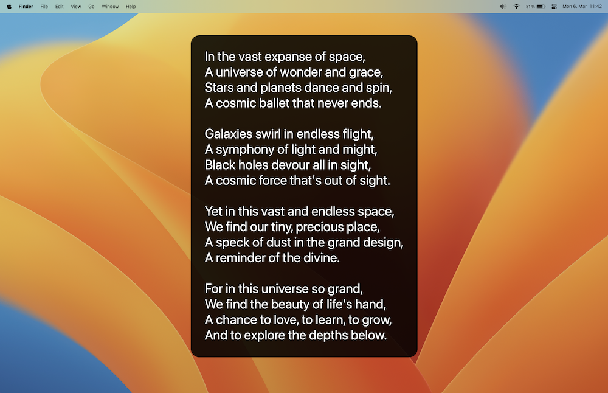

# ChatFred
**[Alfred workflow](https://www.alfredapp.com/workflows/) using [OpenAI's](https://openai.com/) models for chatting and image generation.**

## Setup 🛠️
[⤓ Install on the Alfred Gallery](https://alfred.app/workflows/chrislemke/chatfred/) and add your OpenAI API key. If you have used [ChatGPT](https://chat.openai.com/chat) or [DALL·E 2](https://openai.com/dall-e-2/), you already have an OpenAI account. Otherwise, you can [sign up here](https://beta.openai.com/signup) - You will receive [$18 in free credit](https://openai.com/api/pricing/), no payment data is required. Then you can [create an API key](https://beta.openai.com/account/api-keys).

## Usage 🧑‍💻

### Talk to ChatGPT 💬
To start chatting with ChatGPT just type `cf`, configure your own hotkey or use the workflow as a fallback search in Alfred.

or use ChatFred as a fallback search in Alfred:

The results will always be shown in [Large Type](https://www.alfredapp.com/help/features/large-type/). Check out the [workflow's configuration](https://www.alfredapp.com/help/workflows/user-configuration/) for more options (e.g. *Always copy reply to clipboard*).

#### **`ChatFred_ChatGPT.log`** 📄
Your full conversation with ChatGPT is stored in the file `ChatFred_ChatGPT.log` in the user's home directory (`~/`). This file is needed so ChatGPT can access prior parts of the conversation. You can adjust how far ChatGPT can look back in the conversation in the workflow's configuration (*ChatGPT history length*).

### Text generation by GPT 📘
To start the ChatFred workflow, just type `cft` or configure your own hotkey.

Ask questions:

Translate text:

If the reply is a bit longer just hit <kbd>⌘</kbd> <kbd>⏎</kbd>:

#### **Options** 🤗
To handle the reply of ChatFred you have the following options.
- <kbd>⏎</kbd>: Nothing by default. Set one or more actions in the [workflow’s Configuration](https://www.alfredapp.com/help/workflows/user-configuration/).
- <kbd>⌘</kbd> <kbd>⏎</kbd>: Show the reply in [Large Type](https://www.alfredapp.com/help/features/large-type/) (can be combined with <kbd>⌃</kbd>)
- <kbd>⌥</kbd> <kbd>⏎</kbd>: Let ChatFred speak 🗣️
- <kbd>⌃</kbd> <kbd>⏎</kbd>: Copy the reply to the clipboard (you can also set *Always copy reply to clipboard* in the workflow configuration)
- <kbd>⇧</kbd> <kbd>⏎</kbd>: Write the conversation to file: `ChatFred.txt`. The default location is the user's home directory (`~/`). You can change the location in the workflow's configuration.

#### **Save conversations to file** 📝
If you want to save all requests and ChatFred's replies to a file, you can enable this option in the workflow configuration (*Always save conversation to file*). The default location is the user's home directory (`~/`) but can be changed (*File directory*).

You can also hit <kbd>⇧</kbd> <kbd>⏎</kbd> for saving the reply manually.

### Image generation by DALL·E 2 🖼️
With the keyword `cfi` you can generate images by DALL·E 2. Just type in a description and ChatFred will generate an image for you. Let's generate an image with this prompt:
`a photo of a person looking like Alfred, wearing a butler's hat`. The result will be saved to the home directory (`~/`) and will be opened in the default image viewer.

*That's not really a butler's hat, but it's a start!* 😅

## Configure the workflow (optional) 🦾
You can tweak the workflow to your liking. The following parameters are available. Simply adjust them in the [workflow's configuration](https://www.alfredapp.com/help/workflows/user-configuration/).
- **OpenAI model**: Following models are available: `Ada`, `Babbage`, `Curie`, `Davinci` (ascending quality). Default: `Davinci`.
- **Temperature**: The temperature determines how greedy the generative model is (between 0 and 2). If the temperature is high, the model can output words other than the highest probability with a fairly high probability. The generated text will be more diverse, but there is a higher probability of grammar errors and the generation of nonsense. Default: `0`.
- **Maximum tokens**: The maximum number of tokens to generate in the completion. Default: `50`.
- **Top-p**: Top-p sampling selects from the smallest possible set of words whose cumulative probability exceeds probability p. In this way, the number of words in the set can be dynamically increased and decreased according to the nearest word probability distribution. Default: `1`.
- **Frequency penalty**: A value between `-2.0` and `2.0`. The frequency penalty parameter controls the model’s tendency to repeat predictions. Default: `0`.
- **Presence penalty**: A Value between `-2.0` and `2.0`. The presence penalty parameter encourages the model to make novel predictions. Default: `0`.
- **Always read out reply**: If enabled, ChatFred will read out all replies automatically. Default: `off`.
- **Always save conversation to file**: If enabled, all your request and ChatFred's replies will automatically be saved to a file (`{File directory}/ChatFred.txt`). Default: `off`.
- **File directory**: Custom directory where the 'ChatFred.txt' should be stored. Default to the user's home directory (`~/`).
- **Always copy to clipboard**: If enabled, all of ChatFred's replies will be copied to the clipboard automatically. Default: `off`.
- **Image size**: The size of the by DALL·E 2 generated image. Default: `512x512`.
- **ChatGPT history length**: ChatGPT can target previous parts of the conversation to provide a better result. This value determines how many previous steps of the conversation the model can see. Default: `4`.

You can find more information about the GPT model's parameters [here](https://platform.openai.com/docs/api-reference/completions/create).

## Safety best practices 🛡️
Please refer to OpenAI's [safety best practices guide](https://platform.openai.com/docs/guides/safety-best-practices) for more information on how to use the API safely and what to consider when using it.

## What's next? 🚧
As soon as OpenAI releases the ChatGPT API, we will integrate it into this workflow. Soon we will also implement the [Microsoft Azure OpenAI Service](https://learn.microsoft.com/en-us/azure/cognitive-services/openai/) to provide a broader choice of available services.

If this box is checked ChatFred will show a notification when a reply is copied to the clipboard or an image was generated. For this to work System notifications must be activated for Alfred.
